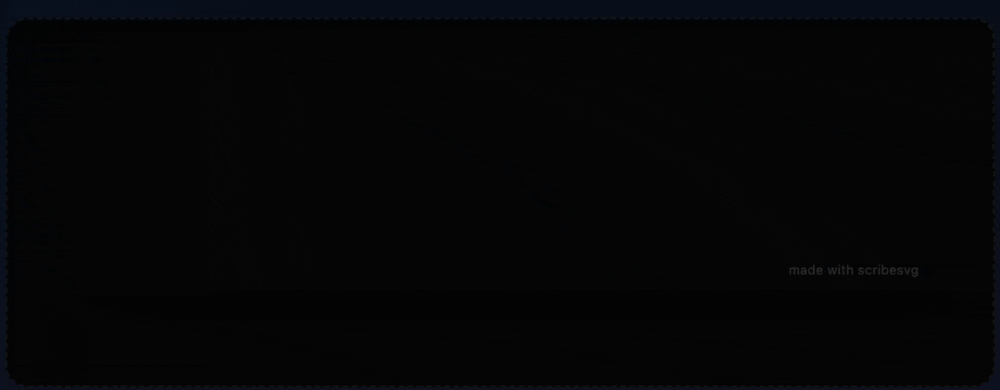

# 🌊 ScribeSVG

**ScribeSVG** is a next-generation, high-performance, and visually stunning typing animation generator for GitHub profiles, repositories, and portfolios. 

Built with **Next.js**, **React**, and **TypeScript**, and running entirely on **Vercel Edge Functions**, ScribeSVG generates lightweight, CSS-only animated SVGs in real-time. It requires zero JavaScript on the client rendering side, making it fully compatible with GitHub's image sandbox and Content Security Policies.



<p align="center">
  <a href="#-features"><strong>Explore Features</strong></a> •
  <a href="#%EF%B8%8F-one-click-deploy"><strong>Deploy Instantly</strong></a> •
  <a href="#-api-reference"><strong>API Docs</strong></a> •
  <a href="#-contributing"><strong>Contribute</strong></a>
</p>

---

## ✨ Features that make ScribeSVG Unique

Most profile widgets output static designs or struggle with browser compatibility. ScribeSVG is engineered with key differences:

*   **🔒 Web Sandbox Font Inlining (Google Fonts)**: Browsers block external network requests inside `` tags, which breaks custom Google Fonts in normal SVGs. ScribeSVG's Edge Engine fetches, parses, and inlines fonts as **Base64-encoded Woff2 data URIs** directly inside the SVG, ensuring your custom fonts render flawlessly for every visitor.
*   **🎨 Custom Layout Mockups**: Renders text standalone, inside a sleek **macOS Terminal Window** (complete with window controls), or inside a **Glassmorphic Card** with glowing borders.
*   **🌈 Text Gradients**: Native linear text gradients (SVG gradient mappings) with angle controls.
*   **💡 Neon Glow Effects**: Customize filter gaussian blurs to apply subtle glowing neon signs to the text and cursor.
*   **⚡ Edge Powered (0ms Cold Starts)**: The rendering API is built on Vercel Edge Runtime. It compiles to V8 isolates, delivering response times under 50ms, with global CDN caching.
*   **🧹 Short, Clean URLs**: The builder only serializes non-default properties, keeping your Markdown clean and lightweight.

---

## 🚀 Interactive Playground

ScribeSVG comes with a local, fully interactive visual builder interface. Toggle styles, add text lines, try preset themes (like Dracula, Cyberpunk, or Tokyo Night), change preview backgrounds to match GitHub Dark/Light modes, and copy code in one click.

To run it locally:
```bash
npm run dev
# or
yarn dev
```
Open [http://localhost:3000](http://localhost:3000) to view the builder playground.

---

## 🛠️ One-Click Deploy

Host your own instance of ScribeSVG globally for free in less than 2 minutes.

[](https://vercel.com/new/clone?repository-url=https%3A%2F%2Fgithub.com%2FDhanushNehru%2FScribeSVG)

---

## 📌 API Reference

Serve animations dynamically by appending parameters to the `/api/render` endpoint.

| Parameter | Type | Default | Description |
| :--- | :--- | :--- | :--- |
| `lines` | `string` | `Hello World` | Semicolon-separated text lines to type. (e.g. `lines=Hello;World`) |
| `layout` | `string` | `raw` | Choose frame: `raw` (none), `terminal` (macOS shell), `card` (glow container). |
| `theme` | `string` | `none` | Pre-configured style: `dracula`, `cyberpunk`, `tokyonight`, `nord`, `synthwave`, `sunset`, `matrix`. |
| `font` | `string` | `Fira Code` | Any Google Font (e.g. `Orbitron`, `Inter`) or system-safe font family. |
| `size` | `number` | `24` | Font size in pixels. |
| `color` | `string` | `36bcf7` | Hex code for text (without `#`). |
| `gradient` | `string` | `none` | Comma-separated hex colors (without `#`) for linear gradient. |
| `background` | `string` | `transparent` | Hex code for background. Set to `transparent` for overlay. |
| `cursor` | `string` | `pipe` | Cursor shape: `pipe` (`\|`), `block` (`█`), `underscore` (`_`), `none`. |
| `speed` | `number` | `100` | Typing speed in milliseconds per character. |
| `deleteSpeed` | `number` | `50` | Deletion speed in milliseconds per character. |
| `pause` | `number` | `1500` | Pause duration in milliseconds after text types out. |
| `textGlow` | `number` | `0` | Neon glow intensity in pixels. |
| `center` | `boolean` | `false` | Set to `true` to center-align the text horizontally. |
| `attribution` | `boolean` | `true` | Set to `false` to hide the small watermark. |

### Example URL
```html
https://your-domain.com/api/render?lines=Fullstack+Engineer;Open+Source+Contributor&layout=terminal&theme=dracula&center=true
```

---

## 🤝 Contributing

Contributions make the open-source community an amazing place to learn and create. Any contributions you make are **greatly appreciated**.

### Adding a Theme Preset
We encourage adding new beautiful themes. Simply open [src/app/api/render/renderer.ts](src/app/api/render/renderer.ts) and add your custom preset to the `THEMES` object:

```typescript
export const THEMES: Record<string, Partial<RenderOptions>> = {
  // Add your preset style details here
  mycooltheme: {
    color: '#ffffff',
    gradient: ['#color1', '#color2'],
    background: '#121212',
    cursorColor: '#color1',
    font: 'Outfit'
  }
}
```
Then, update the `THEME_PRESETS` list in [src/app/page.tsx](src/app/page.tsx) to render it in the builder UI!

---

## 💖 Sponsors & Backing

If you find this widget useful, please consider starring the repository or supporting the project's development. 

Sponsors will be displayed prominently on the live dashboard and interactive builder website.

---

## 📄 License

Distributed under the MIT License. See `LICENSE` for more information.
